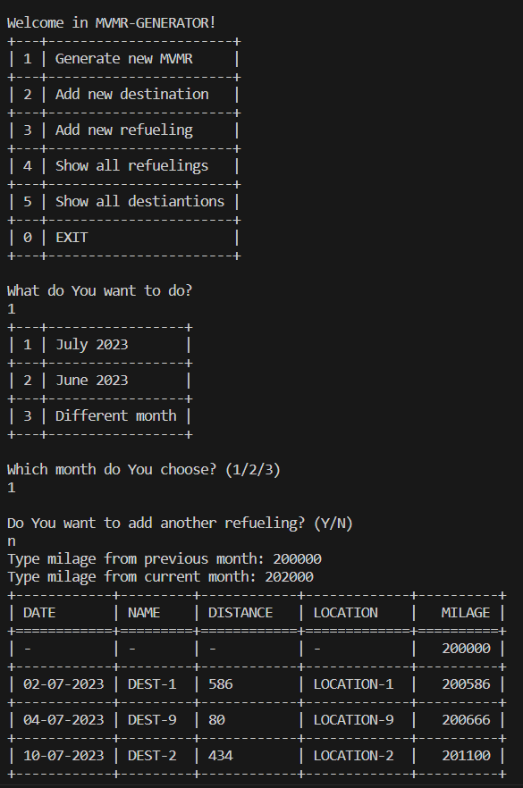
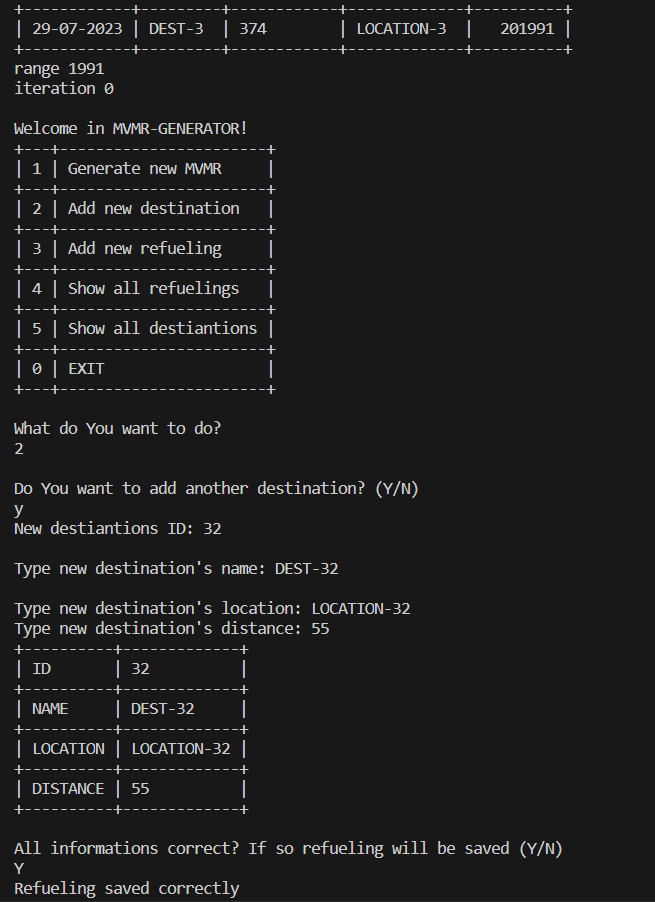

Monthly Vehicle Mileage Reports (MVMR) Generator

1. Overview:
   
    The Monthly Vehicle Mileage Reports (MVMR) Generator is a Python script that helps users manage their vehicle mileage data and generate monthly reports with        calculated trips based on destinations and refuelings.

2. Features:
   
    Manage Destinations: Add new destinations, view existing destinations, and store them in a file.
    Manage Refuelings: Add new refuelings, view existing refuelings, and store them in a file.
    Generate Monthly Mileage Reports: Generate a table of trips for a given month, considering destinations, refuelings, and mileage information.

3. Requirements:
   
    Python 3.5 or higher

4. Installation:
    Clone the repository:
      git clone https://github.com/SebastianSkrzypczak/MVMR-GENERATOR.git
    
    Install the required dependencies:
      pip install -r requirements.txt

5. Usage:
   
    Add Destinations:
   
      Run the script and select "Add new destination" from the menu.
      Provide the destination's name, location, and distance.
      The destination will be stored in the "DESTINATIONS.txt" file.

    Add Refuelings:
   
      Run the script and select "Add new refueling" from the menu.
      Enter the refueling date, volume, and the nearest destination ID from the list of existing destinations.
      The refueling will be stored in the "REFUELINGS.txt" file.
   
    Generate Monthly Mileage Reports:
   
      Run the script and select "Generate new MVMR" from the menu.
      Choose the month and year for which you want to generate the report.
      The script will calculate trips based on destinations, refuelings, and mileage information and display them in a table.

6. Acknowledgments:
 
    The script utilizes the tabulate library for generating tabular output.
    The dateutil library is used for handling dates and times.

7. Author:
    
    Sebastian Skrzypczak
   
    For inquiries, please contact: sebastian.skrzypczak98@gmail.com
   

